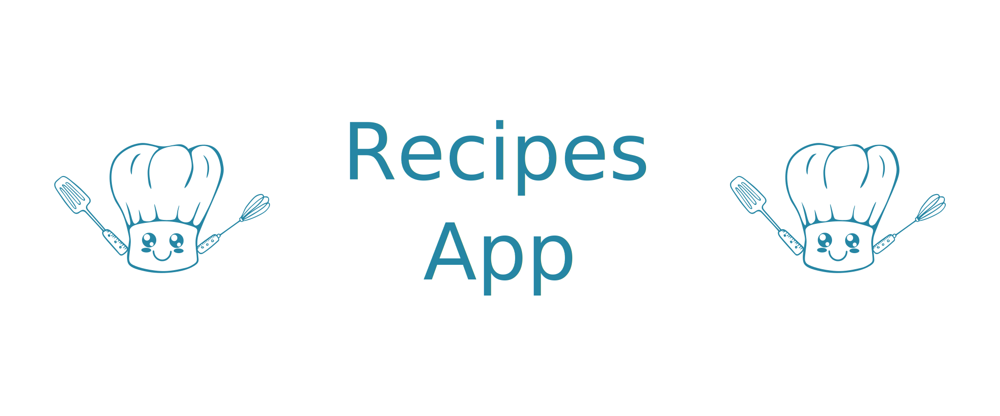

<p align="center">
  

  
  
  <a href="https://github.com/MuriloGon/recipe-app/commits/master">
    
  </a>

  

  <a href="https://github.com/MuriloGon/recipe-app/stargazers">
    
  </a>
</p>
<h1 align="center">
    
</h1>

<h2 align="center"> 
	Recipe App
</h2>

<p align="center">
  <a href="#about-the-project">About the project</a>
  <a href="#motivation">Motivation</a>
  <a href="#functionalities">Functionalities</a>
  <a href="#screenshots">Screenshots</a>
  <a href="#installation-and-usage">Installation and Usage</a>
  <a href="#tech-and-framework-used">Tech/Framework used</a>
  <a href="#author">Author</a>
  <a href="#license">License</a>
</p>

## About the project

This is an app of recipes, using what is most modern within the React ecosystem: Hooks and Context API. It is possible to view, search, filter, bookmark and follow the process of preparing recipes and drinks. The database consists of 2 different APIs, one for food and one for beverages. The layout focuses on mobile devices, so all prototypes are built on smaller screens.

> Project developed at Trybe on Frontend Module. Trybe is a web development school that has a genuine commitment to the professional success of its students. There are more than 1500 hours of training that covers fundamentals of web development, development, front-end, back-end, computer science, software engineering, agile methodologies and soft skills.

---

## Motivation

- Use Redux to manage state
- Using the React-Redux library
- Use the React Context API to manage state
- Use React Hook useState
- Using React Hook useContext
- Using React Hook useEffect
- Create custom hooks

---

## Functionalities

- [x] Testes unitários
- [x] Tela de Login
- [x] Header
- [x] Barra de busca
- [x] Menu inferior
- [x] Tela principal de receitas
- [x] Tela de detalhes de uma receita
- [x] Tela de receita em progresso
- [x] Tela de receitas feitas
- [x] Tela de receitas favoritas
- [x] Tela de explorar
- [x] Tela de explorar bebidas ou comidas
- [x] Tela de explorar ingredientes
- [x] Tela de explorar por local de origem/area
- [x] Tela de perfil

## Screenshots

The mockups are available on Figma:

<a href="https://www.figma.com/file/KfAOrH9pVRDPsFfdVKQgu6/App-Receitas---Grupo-32?node-id=0%3A1">
  
</a>

<table>
  <tr>
    <td></td>
    <td></td>
    <td></td>
    <td></td>
    <td></td>
  </tr>
  <tr>
    <td></td>
    <td></td>
    <td></td>
    <td></td>
    <td></td>
  </tr>
 </table>

https://user-images.githubusercontent.com/45644220/138683964-ee66b477-fd87-4e1b-add5-8450e8c355dc.mp4

https://user-images.githubusercontent.com/45644220/138683984-742fe83f-7d77-4f70-a4df-bfc41c168260.mp4

https://user-images.githubusercontent.com/45644220/138684000-165d2e23-5c29-4be2-b53a-4d96513273be.mp4

https://user-images.githubusercontent.com/45644220/138684026-66d66745-b656-465b-9509-38c7d088dd28.mp4

https://user-images.githubusercontent.com/45644220/138684044-25bd5fa7-adf7-4df2-aef0-a97f9dd46eef.mp4

---

## Installation and Usage

> Install depedencies

```bash
npm install
```

> Start server at localhost:3000 (default)

```bash
npm start
```

## Tech and Framework used

The following tools were used on this project:

#### **Libs** 

- [NodeJS](https://nodejs.org/en/)
- [React](https://reactjs.org/)
- [React Router Dom](https://github.com/ReactTraining/react-router/tree/master/packages/react-router-dom)
- [React Icons](https://react-icons.github.io/react-icons/)
- [React Transition Group](https://reactcommunity.org/react-transition-group/)
- [Styled components](https://styled-components.com/)
- [Reduxjs/toolkit](https://redux-toolkit.js.org/)

#### **Utilities**

- Mockups: [Figma](https://www.figma.com/)
- Text Editor: [Visual Studio Code](https://code.visualstudio.com/)
- Conventiona lCommit: [Conventional commit](https://github.com/conventional-changelog/commitlint)
- API Debug: [Insomnia](https://insomnia.rest/)
---

## Author

<a href="https://www.linkedin.com/in/MuriloGon/">
  
  <br />
  <sub>
    <b>Murilo Gonçalves</b>
  </sub>
</a>
<br>
<a href="https://www.linkedin.com/in/MuriloGon/">
  
</a>
<a href="mailto:murilogoncalvesdev@gmail.com" target="__blank">
  
</a>

---

## 📝 License

This project is under MIT License [MIT](./LICENSE).

Made by Murilo Gonçalves [Contact Me](https://www.linkedin.com/in/MuriloGon/)
